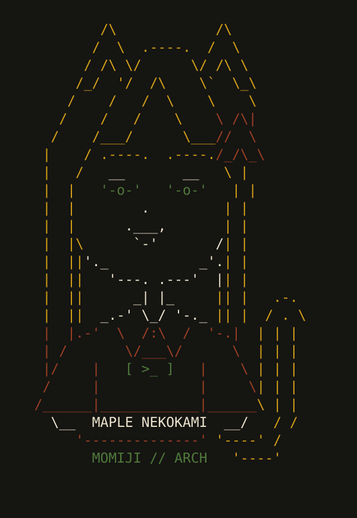

# Maple terminal portrait



A hand-drawn 35-column, 25-row terminal mascot: blonde cat ears and long hair,
half-lidded green eyes, an Arch-shaped hairpin, a terminal badge, and one tail.
The visible art is plain ASCII. Fastfetch's `$1` through `$4` markers supply color;
no Sixel, image decoder, font icons, extra service, or network call is required.

## Install on Momiji

From your checkout, as your normal user:

```fish
cd ~/momiji-dots
and git pull --ff-only
and fish scripts/momiji-maple.fish install
```

Open a new terminal afterward. Plain `fastfetch` and the Fish greeting both use
the portrait. Do not run the full system deployment just to change this logo.
The full `scripts/deploy-configs.sh` also installs it for future provisioning.

Requires Fish, Python 3 (standard library only), and Fastfetch. The Fish entry
point calls the adjacent Python helper so JSONC, paths, backups, and editor
arguments can be handled safely. It does not install packages or run Git.

## Preview, edit, recolor, undo

```fish
fish scripts/momiji-maple.fish preview
fish scripts/momiji-maple.fish edit
fish scripts/momiji-maple.fish colors
fish scripts/momiji-maple.fish restore
```

`preview` reads the repository assets without installing them. `edit` opens the
text file in `$VISUAL`, then `$EDITOR`, otherwise an available Vim/Neovim/Nano/Vi.
`colors` opens the palette config instead. Both validate, install, and preview
when the editor exits successfully. Use `--no-preview` to skip the final preview.
For a GUI editor, configure a waiting command, for example `code --wait`.
Edits change your working tree but are never committed or pushed automatically.

The greeting replaces the previous large text banner with a two-line heading.
The existing optional pony fortunes remain. In terminals narrower than 95
columns the Fish greeting stacks the portrait above the system information.
The optional PNG/Sixel and Arch-logo presets remain in the repository unchanged.

## Files and palette

- `rice/fastfetch/maple-ascii.txt`: editable source art.
- `rice/fastfetch/config-maple-ascii.jsonc`: palette and logo settings.
- `scripts/momiji-maple.fish`: command-line entry point.
- `scripts/maple_ascii.py`: installer/editor, with no external Python packages.
- `home/fish/20-greeting.fish`: the greeting installed on your machine.

`$1` is harvest gold (`#D4A017`), `$2` autumn auburn (`#9A3F24`), `$3`
agricultural green (`#4F7A3A`), and `$4` warm ivory (`#EDE4CE`).
Keep color markers intact; their characters do not count toward visible width.
Use spaces, never tabs. The validator permits up to 45 columns and 35 rows.
The static SVG is a reference preview; editing the text does not regenerate it.

## Preservation and backups

Installation updates only the `logo` object in your active Fastfetch config.
Existing modules, display options, comments, and other settings are preserved.
An existing `config.json` is respected; otherwise `config.jsonc` is used. Having
both files is ambiguous, so installation stops rather than choosing one.

The default installed paths are:

```text
~/.config/fastfetch/maple-ascii.txt
~/.config/fastfetch/config.jsonc
~/.config/fish/conf.d/20-greeting.fish
```

`XDG_CONFIG_HOME` and `XDG_STATE_HOME` are respected. Source paths are quoted
literally, including spaces and apostrophes. Symlinks are backed up and replaced
without writing into their destinations. Existing regular-file modes survive.

Changed files are backed up under `~/.local/state/momiji/maple-ascii/backup-*`.
Each backup contains a manifest and the previous files. Writes are atomic per
file, with rollback if a write fails. Identical reinstalls create no new backup.
`restore` undoes the most recent changed install. Repeating it steps backward.
It refuses to overwrite files edited after installation; preserve those edits
and use the printed backup directory for a manual restore instead.

## Tests

```fish
python3 -B -m unittest discover -s tests -v
```

Tests exercise JSONC/comment preservation, config ambiguity, idempotence,
symlinks, file modes, backups, restore, and art validation. Fish syntax and actual
Fastfetch rendering are checked when those executables exist. The dedicated
GitHub Actions Arch job installs both and runs the same suite.

References: [Fastfetch logo options](https://github.com/fastfetch-cli/fastfetch/wiki/Logo-options)
and [Fish greeting documentation](https://fishshell.com/docs/current/cmds/fish_greeting.html).
